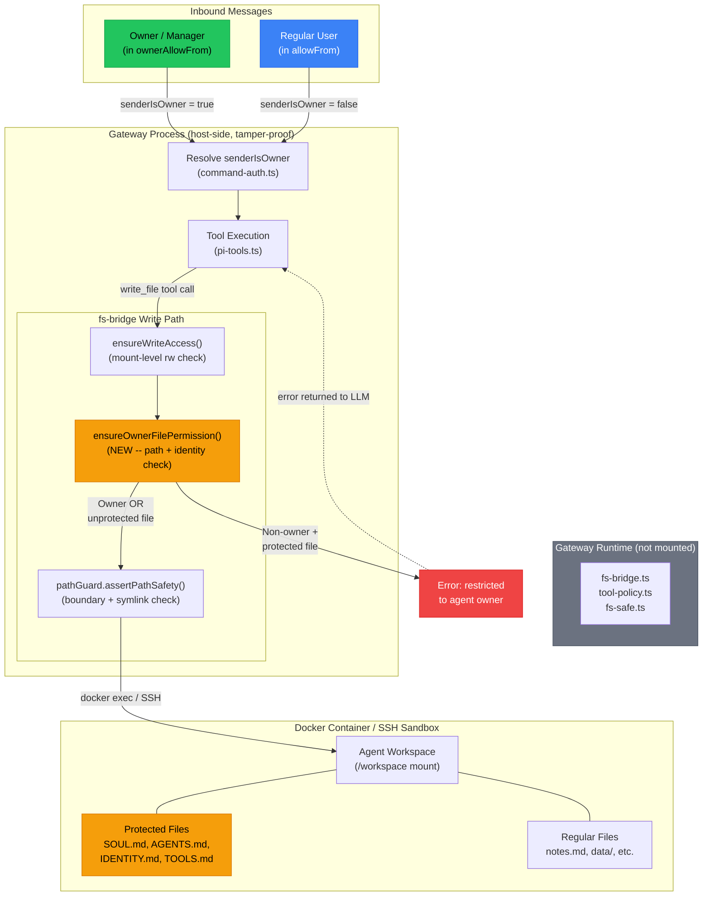

# Owner-Only File Permissions

Status: **Proposal**
Authors: @SidU
Date: 2026-03-28

## Problem

When an agent is deployed in a multi-user environment (for example, an A365
tenant where multiple users can message the same agent), any authorized sender
can instruct the agent to modify sensitive workspace files such as `SOUL.md`,
`AGENTS.md`, `IDENTITY.md`, and `TOOLS.md`. The existing `allowFrom` config
controls who can *message* the agent, and the `ownerAllowFrom` config controls
who can run *owner-only tools*, but there is no enforcement of who can write to
specific *files* inside the agent workspace.

This means a non-owner user can instruct the agent to rewrite its own persona,
identity, memory, or tool definitions -- effectively taking control of the
agent's behavior for all future interactions.

## Goals

1. Allow agent owners/managers to designate files as owner-only-writable.
2. Enforce this at the gateway level so the agent cannot bypass the guard.
3. Work across both sandboxed (Docker, OpenShell/SSH) and non-sandboxed paths.
4. Reuse the existing `senderIsOwner` identity chain -- no new auth system.

## Non-Goals

- Per-file ACLs with multiple permission levels (read/write/admin).
- Protecting files from the agent owner themselves.
- Encrypting or signing workspace files at rest.

## Existing Infrastructure

### senderIsOwner identity chain

The `senderIsOwner` boolean already flows end-to-end:

1. **Gateway auth** -- `commands.ownerAllowFrom` config list or
   `operator.admin` scope on the connecting client
   (`src/gateway/server-methods/tools-effective.ts:130`).
2. **Reply pipeline** -- threaded through `get-reply-run.ts:552` into tool
   creation.
3. **Tool creation** -- passed to `createOpenClawCodingTools()` via
   `pi-tools.ts:274`.
4. **Tool policy** -- `applyOwnerOnlyToolPolicy()` in `tool-policy.ts:46`
   strips or wraps owner-only tools.

### ownerOnly tool gating

Tools declare `ownerOnly: true` (for example `cron`, `gateway`, `nodes` in
`src/agents/tools/`). The policy layer:

- Removes owner-only tools from the tool list for non-owner senders.
- Wraps `execute()` with an error throw as defense-in-depth.
- Reference: `src/agents/tool-policy.ts:19-29`.

### Sandbox fs-bridge write path

Every file mutation from a tool call flows through the gateway-hosted
fs-bridge, not direct filesystem access inside the container:

```
LLM tool call
  -> Gateway process (host)
    -> SandboxFsBridge.writeFile()      # host-side
      -> ensureWriteAccess()            # host-side guard
      -> pathGuard.assertPathSafety()   # host-side guard
      -> docker exec / SSH              # crosses into sandbox
        -> file written
```

Key enforcement points (all host-side, unreachable by the agent):

| Path | Method | Lines |
|------|--------|-------|
| `src/agents/sandbox/fs-bridge.ts` | `ensureWriteAccess()` | 113, 139, 165, 192 |
| `extensions/openshell/src/fs-bridge.ts` | `ensureWritable()` | 72, 98, 122 |
| `src/infra/fs-safe.ts` | `writeFileWithinRoot()` | 547 |

### Default protected files (candidates)

From `src/agents/workspace.ts`:

| File | Constant | Purpose |
|------|----------|---------|
| `SOUL.md` | `DEFAULT_SOUL_FILENAME` | Agent persona and tone |
| `AGENTS.md` | `DEFAULT_AGENTS_FILENAME` | Agent definitions |
| `IDENTITY.md` | `DEFAULT_IDENTITY_FILENAME` | Agent identity and branding |
| `TOOLS.md` | `DEFAULT_TOOLS_FILENAME` | Custom tool documentation |
| `MEMORY.md` | `DEFAULT_MEMORY_FILENAME` | Persistent memory |
| `USER.md` | `DEFAULT_USER_FILENAME` | User context and profile |
| `HEARTBEAT.md` | `DEFAULT_HEARTBEAT_FILENAME` | Background task config |
| `BOOTSTRAP.md` | `DEFAULT_BOOTSTRAP_FILENAME` | Onboarding guide |

## Proposed Design

### Config surface

Add `ownerOnlyFiles` to the agent or commands config:

```yaml
commands:
  ownerAllowFrom:
    - "discord:123456789"
  ownerOnlyFiles:
    - "SOUL.md"
    - "AGENTS.md"
    - "IDENTITY.md"
    - "TOOLS.md"
    - ".openclaw/**"
```

The list accepts exact filenames (relative to workspace root) and glob
patterns. An empty list disables the guard. A sensible default list should
be provided out of the box.

### Enforcement point: fs-bridge (sandboxed path)

Thread `senderIsOwner` into `SandboxContext` alongside the existing
`workspaceAccess` field:

```typescript
// src/agents/sandbox/types.ts
export type SandboxContext = {
  // ... existing fields ...
  senderIsOwner: boolean;
  ownerOnlyFiles: string[];
};
```

Add `ensureOwnerFilePermission()` in `src/agents/sandbox/fs-bridge.ts`,
called immediately after `ensureWriteAccess()` in `writeFile`, `remove`,
`rename`, and `mkdirp`:

```typescript
private ensureOwnerFilePermission(
  target: SandboxResolvedFsPath,
  action: string,
) {
  if (this.sandbox.senderIsOwner) return;
  if (this.sandbox.ownerOnlyFiles.length === 0) return;

  const relative = target.relativePath;
  if (matchesAny(relative, this.sandbox.ownerOnlyFiles)) {
    throw new Error(
      `File "${relative}" is restricted to the agent owner; `
      + `cannot ${action} as a non-owner sender.`
    );
  }
}
```

This runs host-side in the gateway process. The agent inside the sandbox
cannot reach or modify this code.

### Enforcement point: fs-safe (non-sandboxed path)

For the host-workspace write path (`src/infra/fs-safe.ts`), add an
equivalent check inside `writeFileWithinRoot()`. Since `senderIsOwner` is
not currently available at that layer, either:

1. Thread it through the `writeFileWithinRoot` params (preferred), or
2. Add a `beforeWrite` hook that the tool layer registers with the
   sender context.

### Enforcement point: OpenShell fs-bridge

Same pattern in `extensions/openshell/src/fs-bridge.ts` -- add the guard
next to `ensureWritable()` at lines 72, 98, 122. The `SandboxContext`
already flows into the OpenShell bridge constructor.

### Why the agent cannot bypass this

The guard runs in the **gateway process on the host**. The agent interacts
only via tool calls, which are dispatched by the gateway. The code path is:

1. Agent (LLM) emits a tool call (for example `write_file`).
2. Gateway process receives the tool call and invokes
   `SandboxFsBridge.writeFile()`.
3. `ensureOwnerFilePermission()` checks the target path against the
   configured owner-only file list and the `senderIsOwner` flag.
4. If denied, the tool returns an error to the LLM. The write never
   reaches the container.
5. If allowed, the gateway runs `docker exec` to perform the write
   inside the container.

The agent cannot modify `fs-bridge.ts` because:

- In Docker sandbox mode, the gateway runtime is not mounted into the
  container. Only the workspace and agent directories are bind-mounted.
- In OpenShell/SSH mode, the plugin code runs on the gateway host; the
  mirror sync excludes host runtime directories.
- In non-sandboxed mode, OS-level file permissions (running the gateway
  as a separate user) or a read-only bind mount of the runtime directory
  provide the isolation.

### Error behavior

When a non-owner write is blocked, the tool returns a clear error message:

```
File "SOUL.md" is restricted to the agent owner;
cannot write files as a non-owner sender.
```

This lets the LLM explain to the user why the operation was denied,
rather than failing silently.

## Architecture Diagram



The key insight: the **gateway process** is the trust boundary. All three
guards (write access, owner file permission, path safety) run host-side
before any command crosses into the sandbox. The agent cannot modify the
gateway runtime because it is not mounted into the container.

## Implementation Plan

### Phase 1: Config and types

1. Add `ownerOnlyFiles` to the config schema
   (`src/config/types.messages.ts` or a new `types.file-permissions.ts`).
2. Add `senderIsOwner` and `ownerOnlyFiles` to `SandboxContext`
   (`src/agents/sandbox/types.ts`).
3. Thread `senderIsOwner` from `createOpenClawCodingTools()` into the
   sandbox context construction (`src/agents/sandbox/context.ts`).

### Phase 2: Sandbox fs-bridge guard

4. Add `ensureOwnerFilePermission()` to `src/agents/sandbox/fs-bridge.ts`.
5. Call it in `writeFile`, `mkdirp`, `remove`, `rename` (lines 113, 139,
   165, 192).
6. Add matching guard to `extensions/openshell/src/fs-bridge.ts` (lines
   72, 98, 122).
7. Add matching guard to `src/agents/sandbox/remote-fs-bridge.ts`.

### Phase 3: Non-sandboxed path guard

8. Thread `senderIsOwner` and `ownerOnlyFiles` into
   `writeFileWithinRoot()` in `src/infra/fs-safe.ts`.
9. Or: add a pre-write callback in `createHostWriteOperations()` in
   `src/agents/pi-tools.read.ts`.

### Phase 4: Tests

10. Unit test: `ensureOwnerFilePermission` blocks writes to protected
    files for non-owner senders.
11. Unit test: owner senders can write to protected files.
12. Unit test: unprotected files are writable by any authorized sender.
13. Unit test: glob patterns match correctly.
14. Integration test: end-to-end tool call with `senderIsOwner=false`
    targeting a protected file returns the expected error.

### Phase 5: Defaults and documentation

15. Ship a default `ownerOnlyFiles` list covering `SOUL.md`, `AGENTS.md`,
    `IDENTITY.md`, `TOOLS.md`, and `.openclaw/**`.
16. Document the config option in the security docs.
17. Add a note to the agent onboarding flow about protected files.

## Open Questions

1. **Should `MEMORY.md` be owner-only by default?** Memory is often
   written by the agent itself during normal operation. Making it
   owner-only would break memory updates from non-owner conversations.
   Consider a separate `agentWritable` flag or excluding memory from the
   default list.

2. **Should the guard apply to reads too?** Currently scoped to writes
   only. A non-owner can still read `SOUL.md` (indirectly, through the
   agent's system prompt). Read-gating is a separate concern.

3. **Per-agent overrides?** The current design puts `ownerOnlyFiles` in
   the global `commands` config. Per-agent overrides (in
   `agents.list[].ownerOnlyFiles`) may be needed for multi-agent
   deployments where different agents have different sensitivity levels.

4. **Rename as bypass?** If a non-owner renames `SOUL.md` to `SOUL2.md`,
   edits it, then renames it back, the guard must check both source and
   target paths on rename operations. The current design already calls
   `ensureWriteAccess` on both `from` and `to` in rename -- the
   owner-file guard should follow the same pattern.
